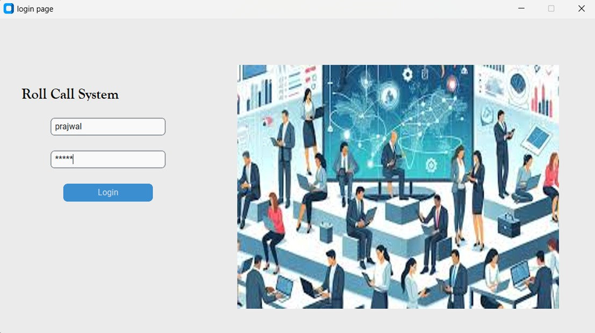

# Employee Management System (Python)

A simple Employee Management System built using Python.  
This project helps manage employee records such as adding, updating, viewing, and deleting employees.

#

## 🚀 Features
- Add new employee
- View employee list
- Update employee details
- Delete employee record
- Simple and easy to use interface

#

## 🛠 Technologies Used
- Python
- File Handling / Database (agar use kiya hai)

#

## 📂 Project Structure
emp-project/
│
├── main.py
├── employee.py
├── database.py
└── README.md

#

## ▶️ How to Run

1. Clone the repository

git clone https://github.com/Prajwal201204/employee-management-system-python.git

2. Go to project folder

cd employee-management-system-python

3. Run the program

python main.py

#

## 👨‍💻 Author
Prajwal Nevase

#

## 🎥 Demo

This project is a simple Employee Management System built using Python that allows users to add, view, update, and delete employee records.
#
#

## 📸 Project Screenshots

### 🔐 Login Page
#

#
#

### ➕ New Employee Page
#
.png)

#
#

### ➕ Add Employee Page
#
.png)

#
#

### ✏️ Update Employee Page
#
.png)

#
#

### ❌ Delete Employee Page
#
.png)
