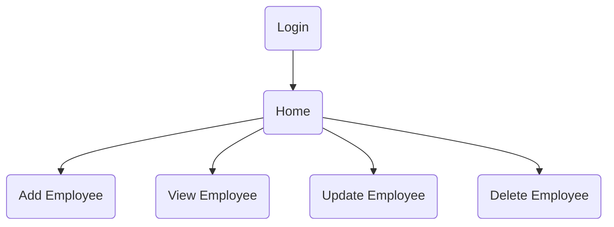
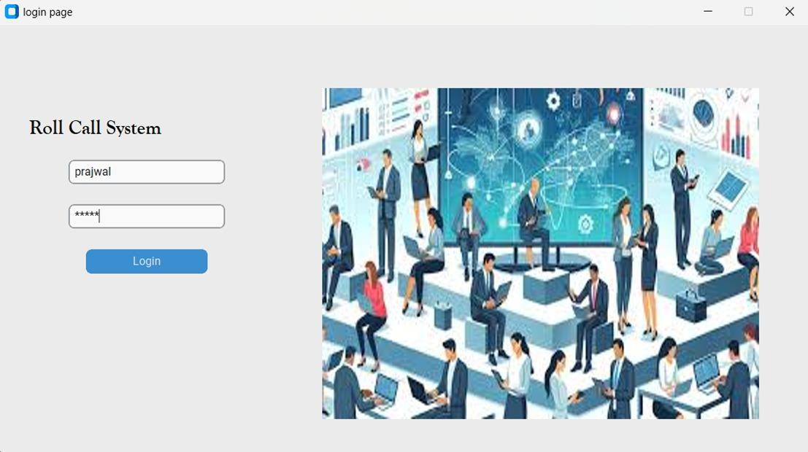
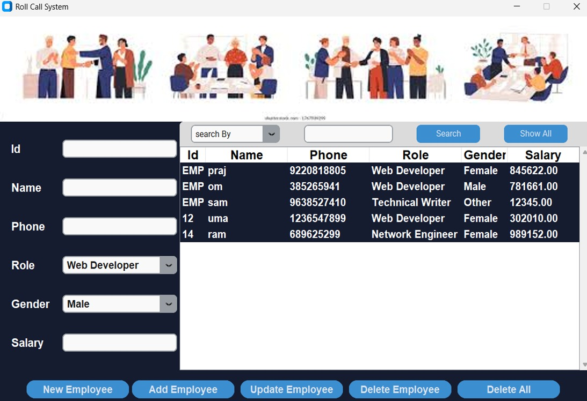
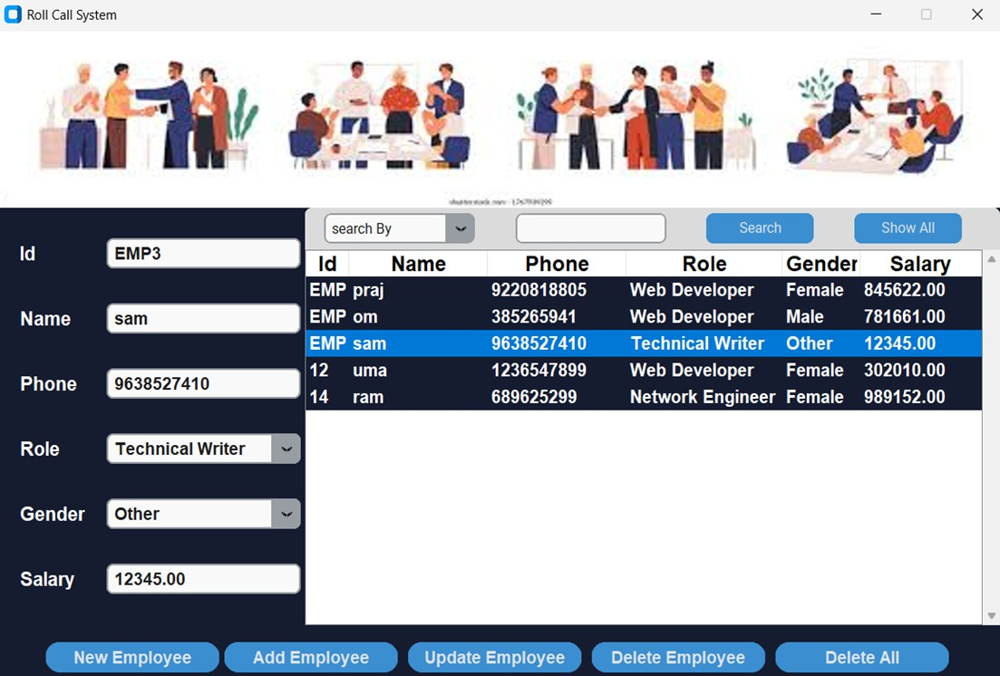
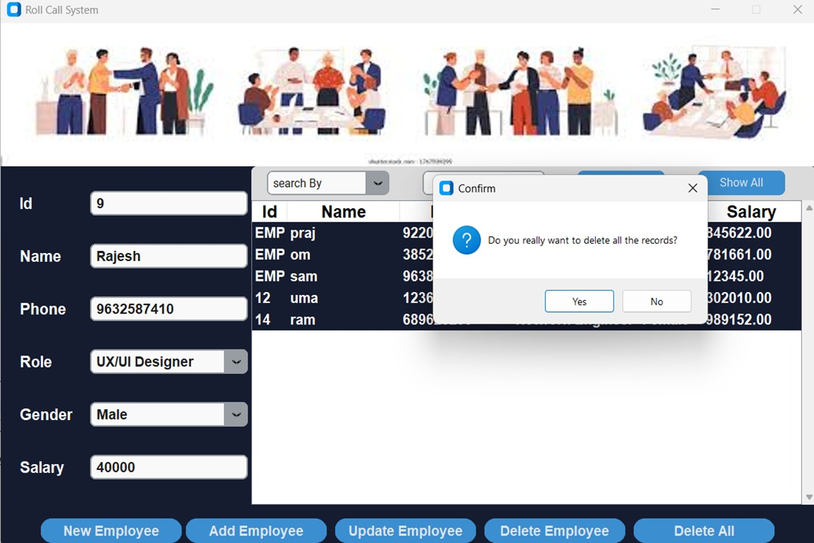

<div align="center">

# 🏢 Employee Management System

### 🚀 A Modern Python Desktop Application for Employee Record Management


<br>


</div>

---

# 🌟 Overview

The **Employee Management System** is a Python-based desktop application that helps organizations efficiently manage employee information. It provides an intuitive interface for adding, updating, viewing, and deleting employee records.

> 🎯 Designed for learning CRUD operations, GUI development, and database/file handling using Python.

---

# ✨ Features

| Feature | Status |
|---------|:------:|
| 🔐 Login System | ✅ |
| ➕ Add Employee | ✅ |
| 📋 View Employee | ✅ |
| ✏️ Update Employee | ✅ |
| ❌ Delete Employee | ✅ |
| 💾 Data Storage | ✅ |

---

# 🛠️ Built With

<p align="center">


</p>

---

# 📂 Project Structure

```text
Employee-Management-System/
│
├── main.py
├── employee.py
├── database.py
├── login_page.png
├── homepage(add_employee).png
├── homepage(update_employee).png
├── homepage(delate_employee).png
└── README.md
```

---

# 🚀 Installation

### Clone Repository

```bash
git clone https://github.com/Prajwal201204/employee-management-system-python.git
```

### Open Project

```bash
cd employee-management-system-python
```

### Run

```bash
python main.py
```

---

# 🔄 Workflow


```mermaid
flowchart TD

A(Login)
B(Home)
C(Add Employee)
D(View Employee)
E(Update Employee)
F(Delete Employee)

A --> B
B --> C
B --> D
B --> E
B --> F
```

---

# 📸 Screenshots

## 🔐 Login Page

<p align="center">

</p>

---

## 🏠 Home Page

<p align="center">

</p>

---


## ✏️ Update Employee

<p align="center">

</p>

---

## ❌ Delete Employee

<p align="center">

</p>

---

# 🎯 Future Scope

- 🔎 Employee Search
- 📊 Dashboard
- 📑 Export PDF
- 📧 Email Notification
- 👥 Multi User Login
- ☁ Cloud Database

---

# 👨‍💻 Developer

<div align="center">

## Prajwal Nevase

🎓 **Master of Computer Applications (MCA)**

💻 **Python Developer**

🚀 Passionate about Software Development, Python Programming, and Learning New Technologies.

<br>

### 📬 Connect With Me

<a href="https://github.com/Prajwal201204">

</a>

<a href="https://www.linkedin.com/in/prajwal-nevase-b47585341">

</a>

<a href="mailto:prajwalnevase2004@gmail.com">

</a>

<br><br>

📧 **Email:** **prajwalnevase2004@gmail.com**

💼 **LinkedIn:** https://www.linkedin.com/in/prajwal-nevase-b47585341

🐙 **GitHub:** https://github.com/Prajwal201204

📍 **Location:** Maharashtra, India

---

### 💡 Motto

> **"Code • Learn • Build • Improve • Never Stop Learning."**

</div>

---

<div align="center">

## 🌟 Support This Project

If you found this project useful,

### ⭐ Please Star this Repository ⭐


</div>
